# 2024_2025_5ISS_BOUKOUISS_BIGOT_BRUNETTO_HENRIET_JOBARD_GAS_SENSOR

## Introduction

The objective of the course is integrate the sensor design and build at AIME with different wireless protocols, including LoRa IoT protocol, but also nodered and Buetooth via an android application. A work has also be done do have adapt the gas sensor signal, with a  trans impedance amplidfier, and also a dedicated shield, to plug into the arduino board, to have a fully compact and easy to use system. However, we have not been able to treat much the data, to have a more intelligent system. The board set up and connections are show in the next pictures.

   

   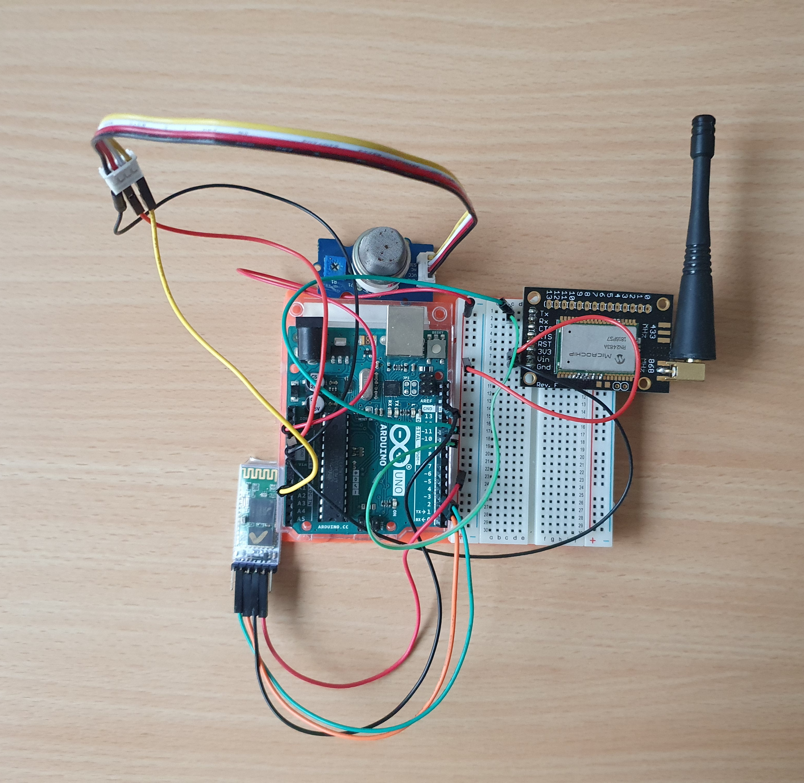
    
   <i>Board Connection</i>
    
   

   

   
       
   <i>Board Connection</i>
    
   

   

## LoRa Communication and MQTT model

This was for us the first time we used LoRa protocol in a concrete project, wich motivate us even more. The idea is to first connected the gas sensor to the arduino board, with the objective to send its values to the LoRa gateway place on the rootop of the GEI.

To do, we used the chirpstack website in order to connect the gateway to within the microchip radio device, that is wired to the arduino.

We first identify the microchip references with the arduino code provided above, and set up these parameters on the chirpsatck website, and with the eduroam wifi connection : https://srv-chirpstack.insa-toulouse.fr/#/regions

	const char *appEui = "0004A30B002159CA";
	const char *appKey = "8d1630b9b6db6270fa1ae3268e610842";

	EUI: 0004A30B002159CA
	Battery: 3953
	AppEUI: 0004A30B002159CA
	DevEUI: 0004A30B002159CA

 
	 
 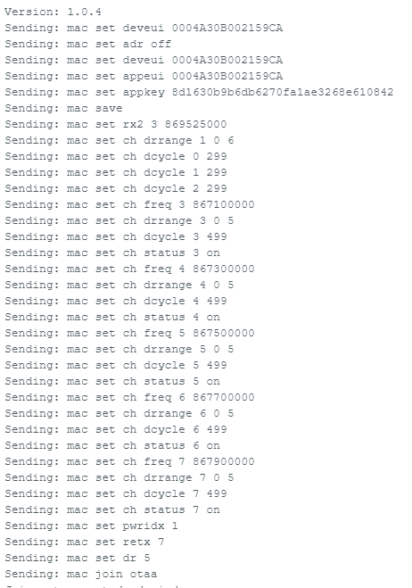
  
 <i>Device informations of the microchip device</i> 
  
 

Once we were connected, we were able to send packet to the gateway, and see the data  on both of the arduino serial window, and on the chirpstack panel dedicated to use the sensor. We also have on the below image, the link with the nodered website, receiving the data too.

## Display the measured data
Once the data was gathered on Chripstack, we wanted to subscribe and be able to see the data as they get measured.
To proceed, we were able to use two development tools to create user interfaces that would properly work with an MQTT communication: NodeRed and MIT App Inventor.

### Nodered
 
NodeRed is a low-code programming tool. 
Through it's ui add-on, it is possible to make simple interfaces.
We were able to create a web interface subscribed to the MQTT broker, displaying the sensor's data.
The next pictures show the results we obtained.

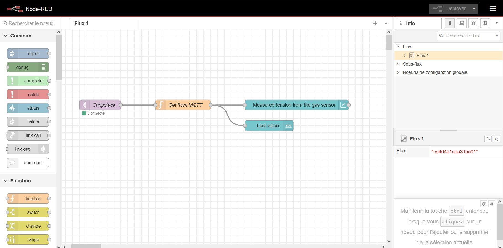
 
<i>The nodes that compose our program</i> 
 
 

	
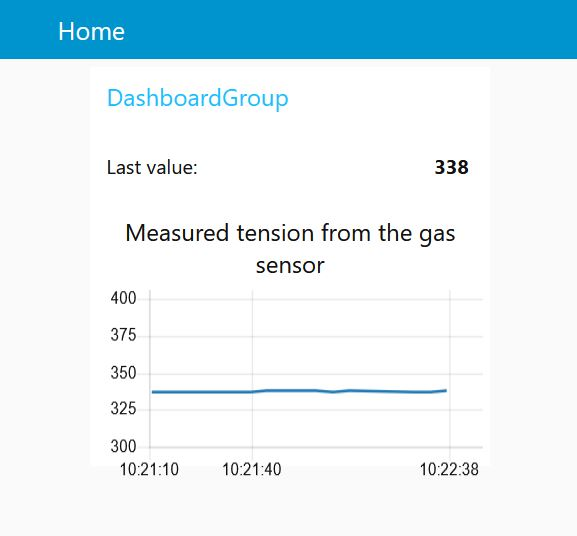
 
<i>The graph with the measurement from our nodered UI</i>  

 

 
  
 <i>Bode diagram of the complet system</i> 
  
 

### MIT App Inventor

In addition to the MQTT and Node-RED components, we included a section in the Arduino code to communicate the gas sensor information to a phone. To achieve this, we used App Inventor for designing the mobile application. The two tabs, "Design" and "Blocks," allowed us to create an application easily and fairly quickly for receiving the sensor's value.

<b>MIT App Inventor</b> is a free online tool offering a user friendly interface for android application development. 
We first had a small introduction by having a led turning on and off using this tool, and then developed a code to send the data from the gas sensor to the smartphone.

 
	 
 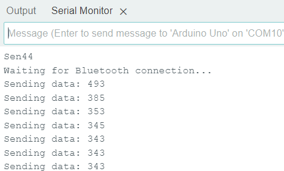
  
 <i>Data send to the smartphone</i> 
  
 

 
 
 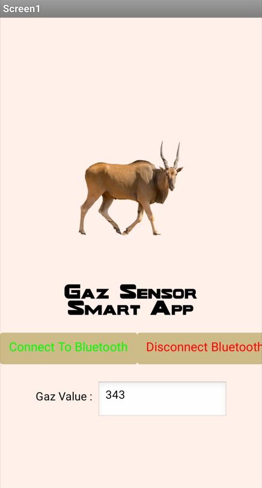
  
 <i>Data received on the application</i> 
  
 

Due to a lack of time, we were unable to go beyond the simple transmission of data to the smartphone. However, this still allowed us to explore Bluetooth communication between the Arduino and the smartphone.

As an improvement, we considered implementing a graphical representation with real-time updates of the gas level. Although we attempted it, we were not able to successfully implement this functionality. We then tried to create an interface to display the evolution of the resistance, meaning of the state of the air, through a live graph.

Another additional feature we could have explored is phone communication, such as sending an SMS when the gas level goes above or below a certain threshold, to explore another communication protocol.

## Integration of our gas sensor from AIME ##

The detailed specifications of our gas sensor can be found in the datasheet. To integrate our gas sensor into the existing monitoring solution with LoRa and Node-RED, replacing the commercial MQ-3B sensor, we will need to follow a series of steps.

Our sensor operates passively, with gas presence detected through changes in its resistance. The sensor will be powered and controlled via an Arduino Uno, and its data will be retrieved using the ADC (Analog-to-Digital Converter).

### Transimpedance amplifier

The first step in processing sensor data is using a transimpedance amplifier to shape the signal for detection by the Arduino's ADC. This stage includes three low-pass filters with the following cut-off frequencies and functions:

Filter 1: 15Hz – designed to minimize noise from the sensor. 
Filter 2: 1.6Hz – aims to eliminate 50Hz noise. 
Filter 3: 1.5,7kHz – adjusts the signal for compatibility with the Arduino's ADC. 

This circuit was simulated in LTSpice to evaluate the performance of the filters and the transimpedance amplifier.

To use our sensor with the arduino board we need first to adapt the signal in order to make it readable for the arduino.This is the objective of this part with LTSpice, adapt the signal within a trans impedance amplifier with multiple filters too. With the sensor we designed at AIME, we are dealing with very low currents and, therefore, very high resistances. This is quite challenging to achieve and often requires expensive equipment. That is why, during the practical sessions, we tried to overcome this difficulty, with a first study of possibilities.

A first solution is to use a direct transimpedance amplifier, but this has a high resistance, is expensive, and is not as precise as desired. Another possibility is to cascade two amplifiers with a bias resistor. The only issue in this case is the energy consumption of the amplifiers, as they are active components. The chosen solution is the use of an amplifier whose only difficulty is that it does not excessively amplify the offset voltage. The LTC1050C meets this condition. It is in fact a trans impedance amplifier. Next, the proposal is to apply different filters:

	- Low-pass filter (passive): to filter high-frequency noise from the sensor
	- Filter (active): to filter ambient 50Hz noise and noise from the amplifier
	- Filter (active): to filter frequencies at the output of the operational amplifier and the ADC to satisfy the Shannon condition

Here are the following simulations in LTspice for our Analysis of the trans impedance amplifier : 

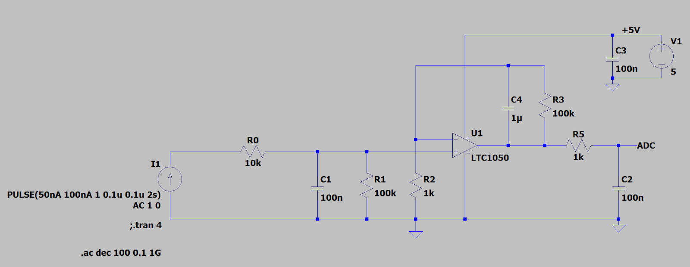
 
<i>Ltspice transimpedance circuit</i> 
 

  

  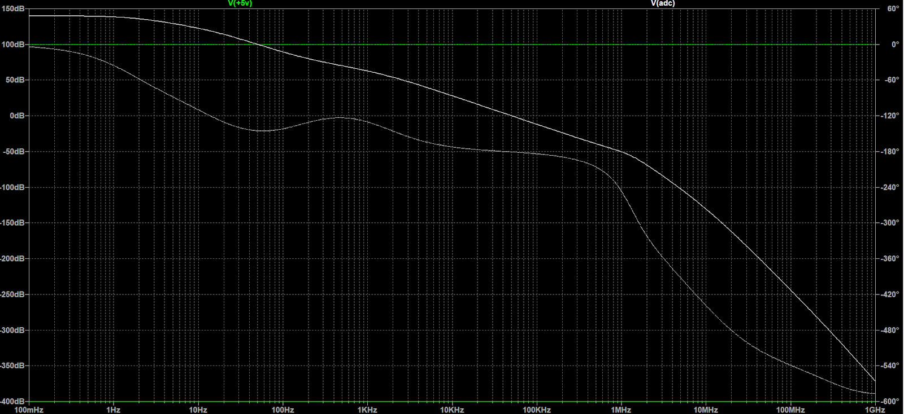
   
  <i>Bode diagram of the transimpedance circuit</i> 
   
  

  
 
  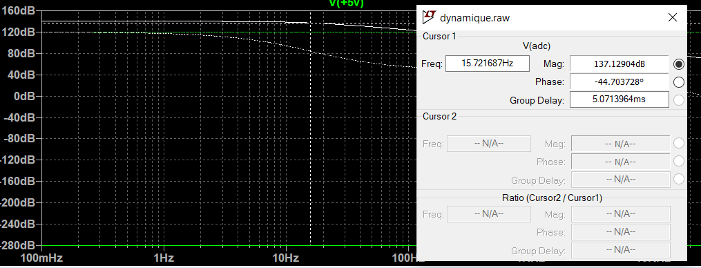
   
  <i>Identification of the first cutoff frequency</i> 
   
  

  
  
  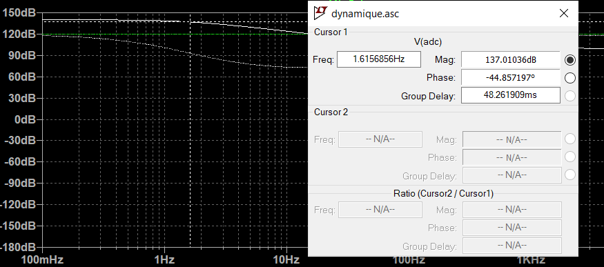
   
  <i>Identification of the second cutoff frequency</i> 
   
  

   
  
  
  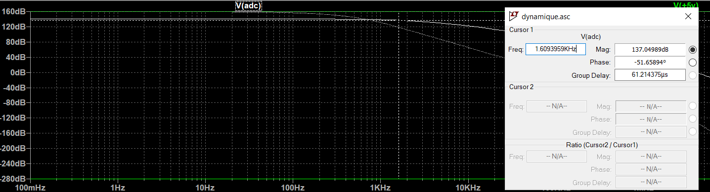
   
  <i>Identification of the third cutoff frequency</i> 
   
  

  

  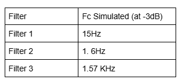
   
  <i>Cutoff table recap</i> 
   
  

The transimpedance amplifier in the schematic diagram of Kicad is shown in the following image.

 
 
 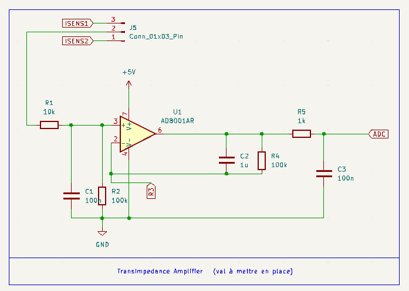
  
 <i>Transimpedance amplifier stage</i> 
  
 

 ### Digital potentiometer
 
We use a digital potentiometer as a variable resistor, specifically the MCP41100. This component operates at 5V and is controlled by the Arduino through SPI using three pins: Clock, MOSI, and CS.

The schematic for this component is shown in the following image.

 
 
 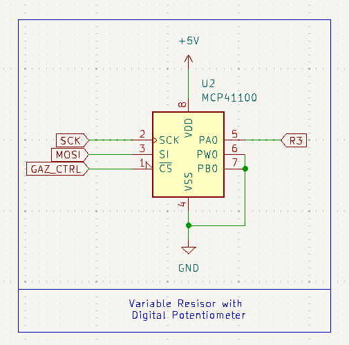
  
 <i>Montage for the digital potentiometer</i> 
  
 

### Heating resistor controlled via PWM

Our sensor is a "smart sensor," featuring a heating resistor (a polysilicon resistor) and a temperature sensor (an aluminum resistor). The heating resistor is controlled by the Arduino via PWM, which is facilitated by the following setup using an IRF540N transistor.

 
 
 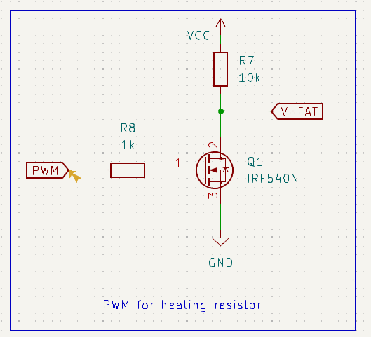
  
 <i>PWM montage with transistor</i> 
  
 

### Sensor connections

We have designed a symbol for our sensor in KiCad. The symbol is linked to the Package_TO_SOT_THT:TO-5-10 footprint, which is used for mounting our sensor.

The schematic of the sensor connections is shown below.

 
 
 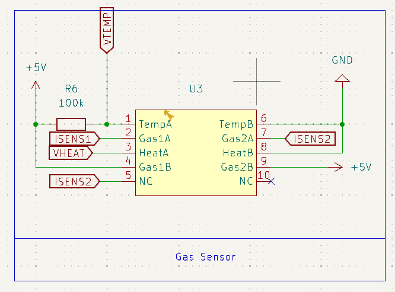
  
 <i>Our gas sensor connections</i> 
  
 

### Global electronic schematic

To get an overview of our electronic schematic, here is an image that illustrates all of our components.

 
 
 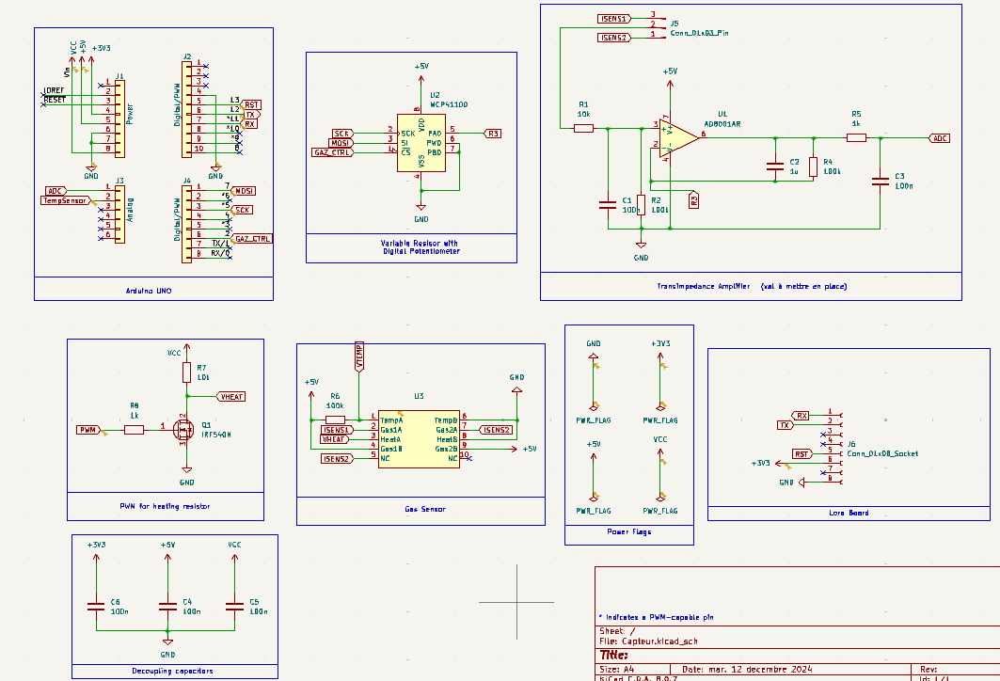
  
 <i>Our electronic schematic</i> 
  
 

 ## Conclusion ##

This project provided a comprehensive introduction to the world of sensors, covering everything from fabrication to data integration on user-friendly dashboards. We were able to develop and strengthen skills in various areas such as LoRa communication and Node-RED applications.
